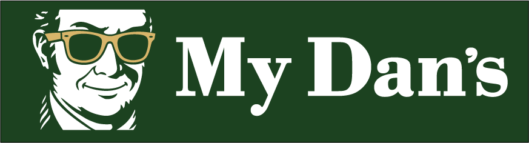

# A staff tool for Dan Murphys.

An Android app for Dan Murphy's floor staff. Search any product in seconds, scan shelf barcodes, and filter inventory with way more precision than the website.

## Why?

I have often found customers asking questions like *"What preservative-free Pinot Noir from New Zealand do you have under $20"* or *"What is your best deal on beers at the moment"*. Sometimes I just don't know the answer, and there really was no way to filter down something so specific without walking up and down isle comparing and reading labels.

As a solution I created a better filter to be able to narrow down and answer these questions more effectively.

With MY Dan's, you can filter:
- Category: Wine → Red Wine → Pinot Noir
- Country: New Zealand
- Price: max $20
- Preservative free
- Alcohol: max 12%

## Features

- **Instant search** — by name or stock code
- **Barcode scanner** — hold to scan shelf labels
- **Smart filters** — category, country, region, price, vintage, alcohol %, price/L
- **Quick sort** — by price, name, ABV, or stock
- **New products** — see what's arrived in the last 90 days
- **Offline data** — 3500+ products built in, live search covers the rest

## Get the app

1. Go to [Releases](https://github.com/CalvFletch/MY-dans/releases)
2. Download the latest APK
3. Open on your Android phone to install

(Or ask your manager to install it via USB.)

## Built for staff

Made by a Dan Murphy's team member, for Dan Murphy's team members. Not affiliated with Dan Murphy's or Endeavour Group.
